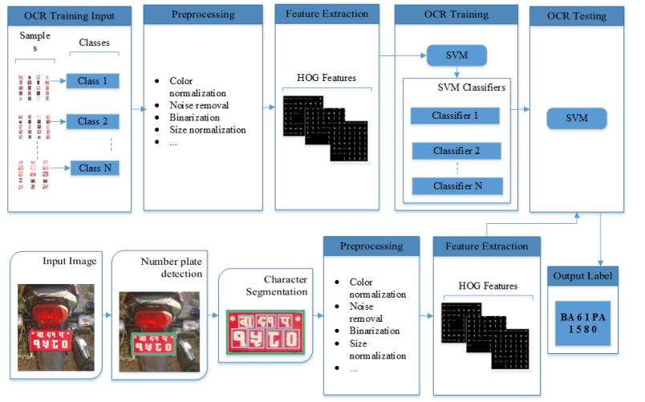
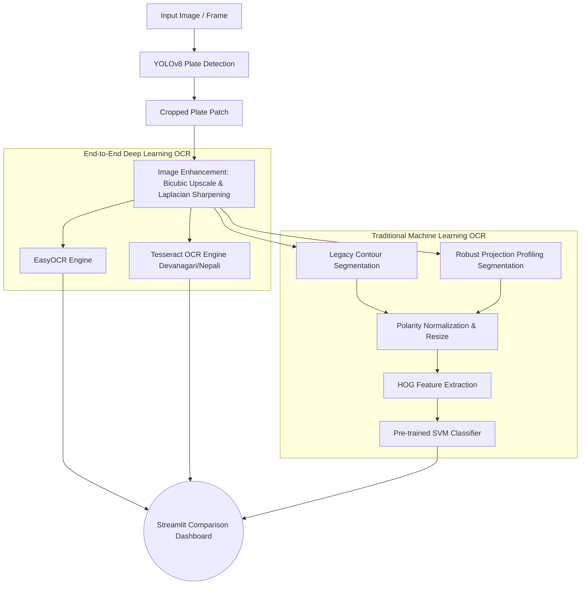

# Real-Time Nepali Number Plate Recognition

## Overview

This project focuses on developing a **Real-Time Nepali Number Plate Recognition** system. It leverages advanced techniques in object detection and optical character recognition (OCR) to identify and recognize Nepali number plates written in the Devanagari script.

The system has recently undergone a major architectural upgrade. We transitioned from a fragile legacy pipeline into a **Modern 4-Way Comparative Architecture**. This allows us to benchmark the original Fellowship project logic against state-of-the-art Deep Learning OCRs and robust mathematical segmentation techniques.

## System Architecture

### 1. The Legacy Pipeline (Fellowship Project)
The original system utilized YOLOv7 for detection and a custom HOG + SVM pipeline for character recognition.



### 2. The Modern Comparative Architecture (Current)
To refine the system and solve issues with blurry crops and connected Devanagari characters, we implemented a massive comparative pipeline. YOLOv8 isolates the plate, the image is mathematically sharpened, and it is fed into four distinct OCR extraction pathways simultaneously.



### Key Engineering Fixes:
- **Image Sharpening**: Added a Laplacian filter to recover edges on heavily blurred real-world plate crops.
- **Polarity Normalization**: The legacy Contour method frequently flipped text polarity based on the plate background color (Red vs White). We added an algorithm to inspect border pixels and mathematically guarantee White Text on a Black Background before SVM inference.
- **Robust Segmentation**: Replaced the fragile Contour method with Horizontal and Vertical Projection Profiling. This acts like a barcode scanner to perfectly slice Devanagari words and numbers, completely ignoring border noise.
- **Multi-Line Sequence Correction**: Fixed a bug where multi-line plates were being sorted purely left-to-right. The system now clusters characters by Y-coordinate into rows, then sorts them left-to-right.

## Project Structure

```
Real-time-Licence-Plate-Recognition/
├── models/                # Saved model weights (best.pt, svm_model.pkl)
├── src/                   # Core application code
│   ├── app.py             # Streamlit 4-Way Comparison UI
│   ├── detection.py       # YOLOv8 inference wrapper
│   ├── segmentation.py    # Robust Projection Profiling
│   ├── ocr_easyocr.py     # EasyOCR wrapper
│   ├── ocr_legacy.py      # Legacy SVM & Robust SVM pipeline
│   ├── ocr_tesseract.py   # Tesseract OCR wrapper
│   └── database.py        # SQLite automated logger
├── logs/                  # Database file and cropped snapshots
├── requirements.txt       # Python dependencies
└── README.md              # Project documentation
```

## Installation & Setup

1. **Clone the repository:**
   ```bash
   git clone https://github.com/SandipAcharya/Real-time-Licence-Plate-Recognition
   cd Real-time-Licence-Plate-Recognition
   ```

2. **Install Python dependencies:**
   ```bash
   pip install -r requirements.txt
   ```

3. **Install Tesseract OCR (Windows):**
   - Download the Tesseract installer from [UB Mannheim](https://github.com/UB-Mannheim/tesseract/wiki).
   - During installation, expand the "Additional Language Data" section and check **"Nepali"** and **"Hindi"**.
   - Ensure it installs to `C:\Program Files\Tesseract-OCR\tesseract.exe`.

4. **Run the Application:**
   Launch the interactive Streamlit dashboard:
   ```bash
   streamlit run src/app.py
   ```

## Web Interface

The Streamlit app features two main tabs:
1. **Detection & OCR**: Upload an image to run the pipeline. You will see a side-by-side segmentation visualizer showing exactly how the Contour and Projection methods sliced the plate, followed by the final text predictions from all 4 OCR engines.
2. **Database Records**: A live view of the automated SQLite database displaying all historically detected plates and their cropped image snapshots.
